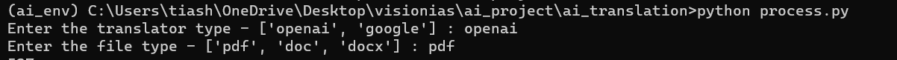

installation
--------------------------

1. create a folder and clone the git repo into it 

File Structure :
------------------------------
1. change the `BASE_FOLDER_PATH` inside the config.file_config file.
2. create a folder named `translation_inputs` inside the base folder and keep all the input files in it.
3. create another folder `translation_outputs` inside the base folder to store the output files.

Execution :
-----------------------------
1. create a virtual env.
2. run requirement.txt with the virtual env.`pip install -r requirements.txt`
3. run process.py . `python process.py`

4. Enter translator type and file type.
5. you can change the input file name from `config.file_config` file.
6. languages can be changed from the `config.message_config.py` file.
7. Openai-related all the configurations can be maintained from the `config.openai_config.py` file.
